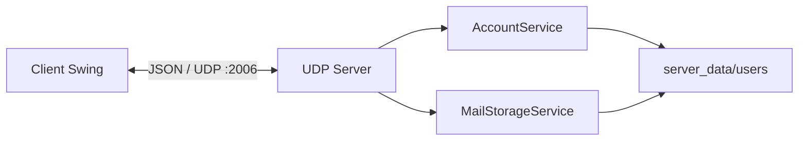

# UDP Mail

Ứng dụng mail desktop theo mô hình **Client–Server**, được xây dựng bằng **Java Swing** và giao tiếp qua **UDP**. Server quản lý tài khoản và email dưới dạng file; client cung cấp giao diện đăng ký, đăng nhập, xem danh sách file, đọc và gửi email.

Repository: [github.com/kyvy12az/UDPMail](https://github.com/kyvy12az/UDPMail)

## Chức năng chính

### Client

- Đăng ký tài khoản mới.
- Đăng nhập và nhận danh sách tên file trong thư mục tài khoản từ server.
- Xem nội dung `user.txt` và các file email.
- Làm mới danh sách file.
- Soạn và gửi email đến một tài khoản khác.
- Đăng xuất.
- Tự gửi lại yêu cầu tối đa 3 lần nếu server không phản hồi; thời gian chờ mỗi lần là 1,8 giây.

### Server

- Giao diện Swing để khởi động/dừng UDP Server.
- Lắng nghe mặc định tại cổng UDP `2006`.
- Xử lý đồng thời yêu cầu bằng nhóm 8 worker thread.
- Quản lý tài khoản, người dùng đang trực tuyến, nhật ký hoạt động và thống kê email.
- Lưu dữ liệu tài khoản và email trên hệ thống file.
- Ghi nhận địa chỉ IP đăng ký và IP gửi email.
- Dùng `requestId` để nhận diện yêu cầu, trả đúng phản hồi và hạn chế xử lý lặp khi client gửi lại gói tin.

## Công nghệ sử dụng

- Java 17
- Java Swing
- UDP (`DatagramSocket`, `DatagramPacket`)
- Maven multi-module
- Jackson Databind 2.18.2 để mã hóa/giải mã JSON
- FlatLaf 3.5.4 và SVG icons cho giao diện

## Kiến trúc



Mỗi request có `action`, `requestId` và `data`. Server trả về `requestId`, `status`, `message` và `data` để client ghép phản hồi với yêu cầu tương ứng.

Các action hiện có:

| Action | Chức năng |
|---|---|
| `REGISTER` | Đăng ký tài khoản |
| `LOGIN` | Đăng nhập và trả về danh sách tên file |
| `LIST_EMAILS` | Tải lại danh sách file của tài khoản |
| `READ_EMAIL` | Đọc nội dung một file |
| `SEND_EMAIL` | Gửi và lưu email |
| `LOGOUT` | Đăng xuất |
| `PING` | Kiểm tra server và nhận thời gian server |

Kích thước một gói tin được giới hạn ở `60.000` byte. Ứng dụng chưa chia nhỏ và ghép lại email vượt quá kích thước này.

## Cấu trúc project

```text
UDPMail/
├── pom.xml
├── common/
│   └── src/main/java/com/udpmail/common/
│       ├── model/                 # User, Email
│       └── protocol/              # Request, Response, codec, action, status
├── server/
│   └── src/main/
│       ├── java/com/udpmail/server/
│       │   ├── ServerApplication.java
│       │   ├── listener/          # Sự kiện cập nhật giao diện server
│       │   ├── network/           # UDPServer, RequestHandler
│       │   ├── service/           # Tài khoản và lưu trữ email
│       │   ├── storage/           # Cấu hình đường dẫn dữ liệu
│       │   └── view/              # Giao diện Swing server
│       └── resources/icons/
├── client/
│   └── src/main/
│       ├── java/com/udpmail/client/
│       │   ├── ClientApplication.java
│       │   ├── network/           # UDPClient
│       │   ├── service/           # AuthService, EmailService
│       │   ├── session/           # Phiên đăng nhập phía client
│       │   └── view/              # Login, Register, Main, Compose
│       └── resources/icons/
└── server_data/
    └── users/                     # Dữ liệu tài khoản và email
```

## Cách lưu dữ liệu

Mặc định, dữ liệu nằm tại:

```text
server_data/users/<username>/
├── user.txt
├── email_001.txt
├── email_002.txt
└── ...
```

`user.txt` lưu thông tin theo dạng:

```text
username: kyvy1902
password: example-password
registerIP: 127.0.0.1
registerTime: 2026-10-04 10:30:00
```

Một file email có dạng:

```text
From: kyvy1902
FromIP: 127.0.0.1
To: valt2006
Subject: Xin chào
SentTime: 2026-10-04 10:35:00

Đây là nội dung email.
```

Khi gửi thành công, server lưu cùng nội dung email vào thư mục của **người nhận** và **người gửi**, với tên tăng dần như `email_001.txt`, `email_002.txt`, ...

> **Lưu ý về mã nguồn hiện tại:** thao tác đăng ký chỉ tạo thư mục tài khoản và `user.txt`. Chức năng tạo `new_email.txt` với thư chào mừng chưa được cài đặt trong `AccountService`.

## Yêu cầu môi trường

- JDK 17
- Maven 3.9 hoặc mới hơn
- Hệ điều hành có môi trường đồ họa để chạy Java Swing

Kiểm tra phiên bản:

```bash
java -version
javac -version
mvn -version
```

Các lệnh trên cần hiển thị Java 17. Project đang cấu hình:

```xml
<maven.compiler.release>17</maven.compiler.release>
```

## Build project

Tại thư mục gốc của repository, chạy:

```bash
mvn clean package
```

Nếu build thành công, Maven sẽ lần lượt build các module `common`, `server` và `client`.

## Chạy ứng dụng

### Cách 1: Chạy bằng IntelliJ IDEA

1. Mở thư mục `UDPMail` dưới dạng Maven project.
2. Chờ Maven tải dependency và index project.
3. Chạy class server:

   ```text
   com.udpmail.server.ServerApplication
   ```

4. Trong giao diện server, nhấn nút khởi động để bắt đầu lắng nghe cổng `2006`.
5. Chạy class client:

   ```text
   com.udpmail.client.ClientApplication
   ```

6. Có thể chạy nhiều instance client để thử đăng ký và gửi mail giữa các tài khoản.

### Cách 2: Chạy bằng Maven

Build và cài các module vào local Maven repository:

```bash
mvn clean install
```

Mở terminal thứ nhất để chạy server:

```bash
mvn -pl server org.codehaus.mojo:exec-maven-plugin:3.5.0:java -Dexec.mainClass=com.udpmail.server.ServerApplication
```

Mở terminal thứ hai để chạy client:

```bash
mvn -pl client org.codehaus.mojo:exec-maven-plugin:3.5.0:java -Dexec.mainClass=com.udpmail.client.ClientApplication
```

Trên PowerShell, các lệnh trên có thể dùng trực tiếp. Luôn khởi động server trước client.

## Cấu hình kết nối

Client mặc định kết nối đến:

```text
Host: 127.0.0.1
Port: 2006
```

Để client kết nối đến server trên máy khác trong mạng LAN:

```bash
mvn -pl client org.codehaus.mojo:exec-maven-plugin:3.5.0:java \
  -Dexec.mainClass=com.udpmail.client.ClientApplication \
  -Dudp.mail.host=192.168.1.10 \
  -Dudp.mail.port=2006
```

Với PowerShell, viết lệnh trên một dòng hoặc dùng dấu backtick để xuống dòng. Máy chạy server cần cho phép **UDP port 2006** qua firewall.

Có thể đổi thư mục dữ liệu của server bằng Java system property:

```text
-Dudp.mail.data=<đường-dẫn-thư-mục-dữ-liệu>
```

Server sẽ sử dụng thư mục `<đường-dẫn-thư-mục-dữ-liệu>/users`.

## Luồng hoạt động chính

### Đăng ký

1. Client gửi `REGISTER` gồm username và password.
2. Server kiểm tra username có 3–30 ký tự, chỉ gồm chữ, số hoặc dấu gạch dưới.
3. Password phải có ít nhất 4 ký tự và không chứa ký tự xuống dòng.
4. Server tạo `server_data/users/<username>/user.txt`.

### Đăng nhập

1. Client gửi `LOGIN`.
2. Server xác thực tài khoản và đánh dấu người dùng đang online.
3. Server mở thư mục của tài khoản, lấy tất cả tên file và trả về client.
4. Client hiển thị danh sách file ngay trên màn hình chính.

### Gửi email

1. Người gửi phải đang đăng nhập.
2. Client gửi `SEND_EMAIL` gồm người gửi, người nhận, tiêu đề và nội dung.
3. Server kiểm tra tài khoản người nhận.
4. Server tạo file `email_NNN.txt` trong thư mục người nhận và một bản trong thư mục người gửi.
5. Email được lưu trên server; server không cần tìm client người nhận để chuyển trực tiếp. Người nhận thấy thư khi đăng nhập hoặc tải lại danh sách.

## Mã trạng thái phản hồi

- `SUCCESS`
- `BAD_REQUEST`
- `ACCOUNT_EXISTS`
- `ACCOUNT_NOT_FOUND`
- `INVALID_PASSWORD`
- `EMAIL_NOT_FOUND`
- `RECEIVER_NOT_FOUND`
- `SERVER_ERROR`

## Hạn chế và lưu ý bảo mật

- UDP không bảo đảm gói tin luôn đến nơi hoặc đến đúng thứ tự. Client có retry, nhưng ứng dụng chưa có cơ chế chia gói, xác nhận theo từng phần hoặc phục hồi email lớn.
- Dữ liệu truyền qua mạng chưa được mã hóa.
- Mật khẩu của tài khoản mới đang được lưu dạng văn bản rõ trong `user.txt`; chỉ tài khoản cũ dùng `passwordHash` mới được hỗ trợ tương thích. Không sử dụng cách lưu này trong môi trường thực tế.
- Phiên đăng nhập được server giữ trong bộ nhớ và sẽ mất khi server dừng.
- Server đang cố định cổng `2006` trong `ServerApplication`; thuộc tính `udp.mail.port` hiện chỉ được client sử dụng.
- `server_data` trong repository chứa dữ liệu mẫu. Không nên commit dữ liệu tài khoản thật hoặc mật khẩu thật.

## Gợi ý kiểm thử nhanh

1. Khởi động server.
2. Mở client thứ nhất và đăng ký `kyvy1902`.
3. Mở client thứ hai và đăng ký `valt2006`.
4. Đăng nhập `kyvy1902`, soạn thư gửi đến `valt2006`.
5. Tại client `valt2006`, nhấn **Làm mới danh sách**.
6. Mở file `email_001.txt` và kiểm tra người gửi, IP gửi, tiêu đề, thời gian và nội dung.

## Giấy phép

Repository hiện chưa công bố tệp giấy phép. Mọi quyền sử dụng và phân phối phụ thuộc vào chủ sở hữu repository.
